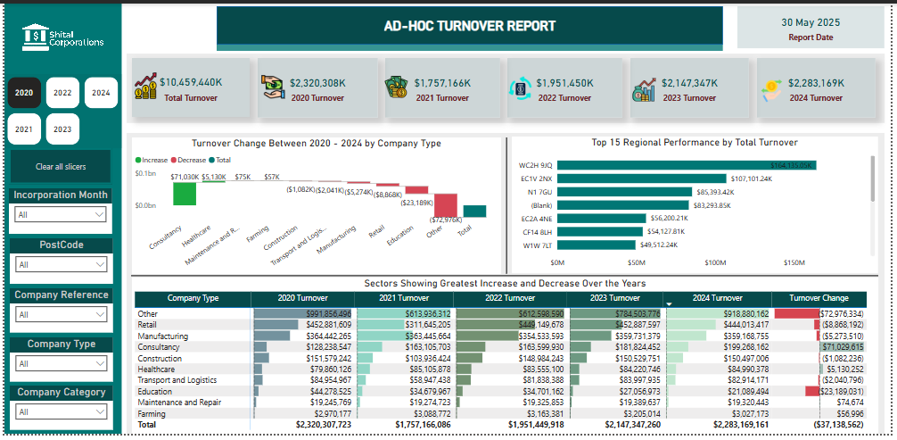

# Project 1

**Title:** [TURNOVER INTERACTIVE DASHBOARD](https://github.com/Tola-Analyst-hub/github.io/blob/main/Shital%20Corporations%20Report.pbix)

**Tools Used:** SQL, POWERBI (Slicers, Pivot Chart, Dax, Bar Chart, Visual Header Tooltips, Measures)

**Project Description:** Had details about what the project is about, why you carried out this project and co

**Key findings:** Key insights you discovered in this project

**Dashboard Overview:** 

# Project 2

**Title:**

**SQL Code:**

**SQL Skills Used:**

**Project Description:**

**Technology used: SQL server**
